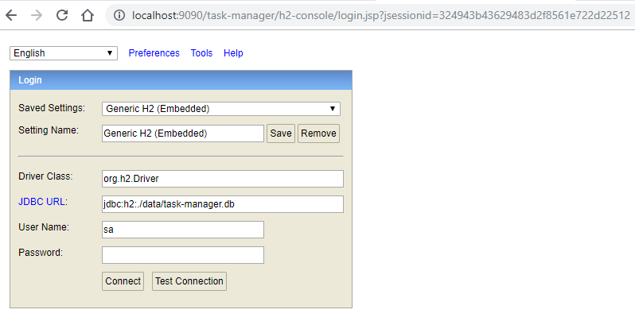
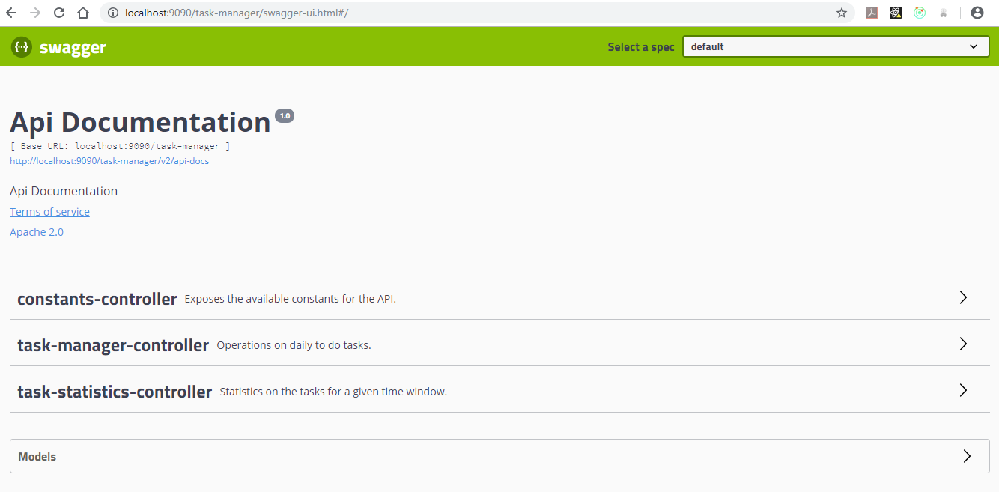

# Task Manager API
This is the back-end part for this training, it's a simple REST API that can be exploited by the React front-end. We used Spring Boot with an embedded H2 database to manage and store data related to daily to do tasks.

## Setup
Once inside the project's directory, execute the following command to build it
``` Bash
mvn clean install
```
once completed with success, you can start the API server with the following command
``` Bash
java -jar ./target/task-manager-0.0.1-SNAPSHOT.jar
```
No need to configure any database as the the data is persisted by an embedded H2 database (see the link http://localhost:9090/task-manager/h2-console to query the data at application startup).



## Overview
This back-end exposes a REST API to manage a list of ToDo tasks, you can consult the contract via this link http://localhost:9090/task-manager/swagger-ui.html.


