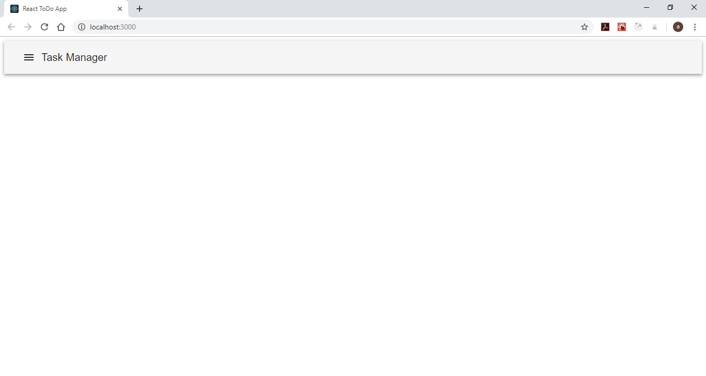

# Task Manager GUI
This is the actual React user interface that we'll use as an elaborate an progressive example for the training.

We did follow the steps below when creating our application:
- [Task Manager GUI](#task-manager-gui)
  - [1. Initialize the project](#1-initialize-the-project)

## 1. Initialize the project
We'll start by creating a blank React application using the command line tool [`create-react-app`](https://github.com/facebook/create-react-app). First we have to install it by invoking
``` Bash
npm install --global create-react-app
```
once finished, we'll create our template
``` Bash
create-react-app task-manager-web-app
cd task-manager-web-app
```
We did change the content and a little bit in the structure of the generated template as shown in the current Git Branch. Under the folder `src` we deleted all the files and we created a folder called `Home` to hold the main page. As shown in the code, we did adopt the [Material UI](https://material-ui.com/) library. Use the following commands to install the Material UI library
``` Bash
npm install @material-ui/core
npm install @material-ui/icons
```
Run the following commands to start the application
``` Bash
npm run build
npm start
```



:information_source: install the [React Snippets](https://marketplace.visualstudio.com/items?itemName=dsznajder.es7-react-js-snippets) VSCode extension to type React specific code faster.

[^Steps](#task-manager-gui)
