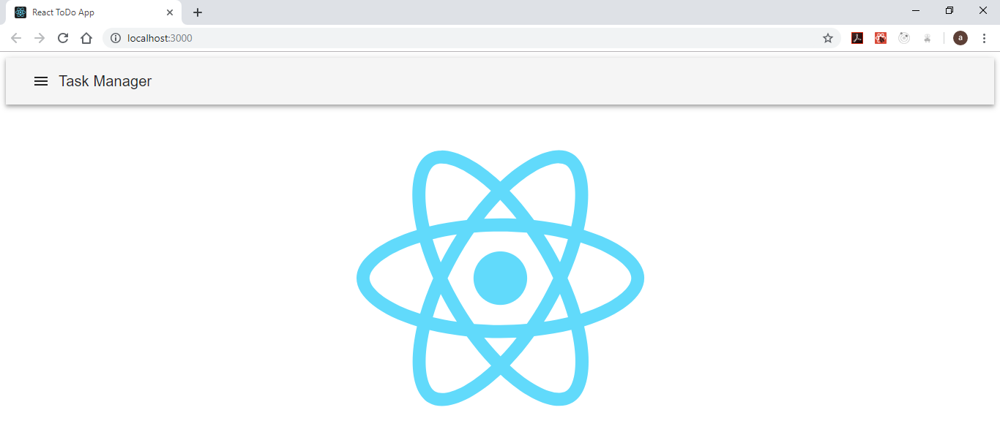
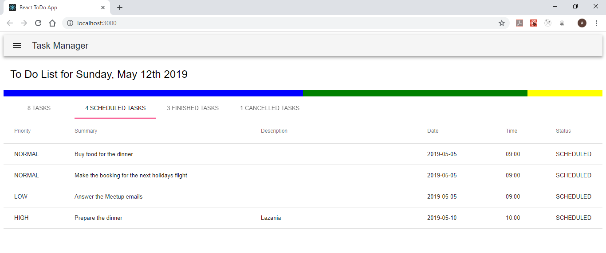
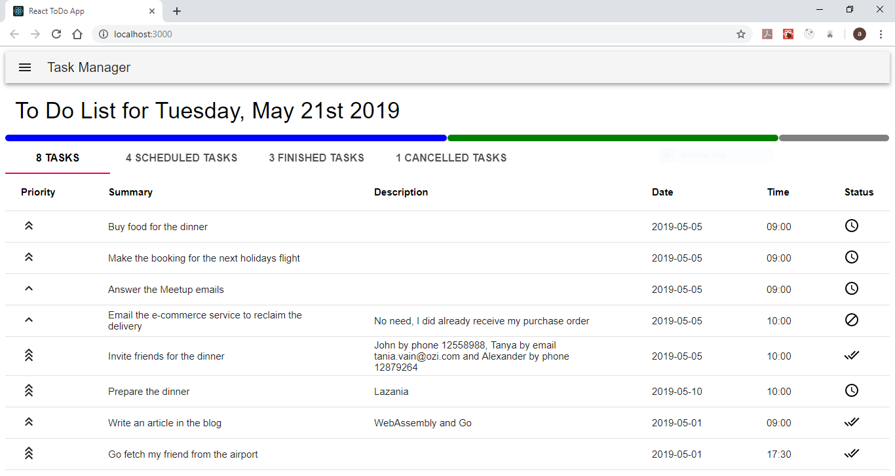

# Task Manager GUI
This is the actual React user interface that we'll use as an elaborate and progressive example for the training.

We did follow the steps below when creating our application:
- [Task Manager GUI](#task-manager-gui)
  - [Initialize the project](#initialize-the-project)
  - [Display mock data in a table](#display-mock-data-in-a-table)
  - [Display the tasks in a tabbed view with a progress bar](#display-the-tasks-in-a-tabbed-view-with-a-progress-bar)
  - [Styling the components the right way](#styling-the-components-the-right-way)

## Initialize the project
We'll start by creating a blank React application using the command line tool [`create-react-app`](https://github.com/facebook/create-react-app). First we have to install it by invoking
``` Bash
npm install --global create-react-app
```
once finished, we'll create our template
``` Bash
create-react-app task-manager-web-app
cd task-manager-web-app
```
We did change the content and a little bit in the structure of the generated template as shown in the current Git Branch. Under the folder `src` we deleted all the files and we created a folder called `Home` to hold the main page. As shown in the code, we did adopt the [Material UI](https://material-ui.com/) library. Use the following commands to install the Material UI library
``` Bash
npm install @material-ui/core
npm install @material-ui/icons
```
Run the following commands to start the application
``` Bash
npm run build
npm start
```



:information_source: install the [React Snippets](https://marketplace.visualstudio.com/items?itemName=dsznajder.es7-react-js-snippets) VSCode extension to type React specific code faster.

**[:arrow_double_up: Steps](#task-manager-gui)**

## Display mock data in a table
We began by displaying mock data in a tabular form in the front page. We did create two functional React components which are the header and the tasks table.
``` JavaScript
export default function Header() {
  return (
    <AppBar position="static" color="default">
      <Toolbar>
        <IconButton color="inherit" aria-label="Menu">
          <MenuIcon />
        </IconButton>
        <Typography variant="h6" color="inherit">
          Task Manager
        </Typography>
      </Toolbar>
    </AppBar>
  );
}
```
``` JavaScript
export default function TasksTable(props) {
  const { tasks } = props;
  return (
    <Table>
      .
      .
      .
      <TableBody>
        {tasks.map(task => (
          <TableRow key={task.id}>
            <TableCell align="left">{task.priority}</TableCell>
            <TableCell align="left">{task.summary}</TableCell>
            <TableCell align="left">{task.description}</TableCell>
            <TableCell align="left">{task.date}</TableCell>
            <TableCell align="left">{task.time}</TableCell>
            <TableCell align="left">{task.status}</TableCell>
          </TableRow>
        ))}
      </TableBody>
    </Table>
  );
}
```
The home page is represented by a class component and did have a state to read mock tasks list at startup.
``` JavaScript
import React, { Component } from 'react';
import Header from '../UI/Header';
import TasksTable from '../TaskManagement';
import mockTasks from '../../shared/mocks/tasks';

export default class Home extends Component {
  constructor(props) {
    super(props);
    this.state = {
      tasks: [],
    };
  }

  componentDidMount() {
    this.setState({
      tasks: mockTasks,
    });
  }

  render() {
    const { tasks } = this.state;
    return (
      <React.Fragment>
        <Header />
        <div style={{ height: '100%', width: '100%' }}>
          <TasksTable tasks={tasks} />
        </div>
      </React.Fragment>
    );
  }
}
```


**[:arrow_double_up: Steps](#task-manager-gui)**

## Display the tasks in a tabbed view with a progress bar
In this step, we did make more components to display in details the tasks' status. Those components are (for the moment) a progress bar indicating the percent of done tasks and a tabbed view with tasks by status. The definition of the components are under the folder `src/components/TaskManagement`.



**[:arrow_double_up: Steps](#task-manager-gui)**

## Styling the components the right way
Our components are a mix of JSX syntax with _iniline Styling_ for CSS  
``` JavaScript
export default class Home extends Component {
  .
  .
  .

  render() {
    const { tasks } = this.state;
    return (
      <React.Fragment>
        <Header />
        <div style={{ height: '100%', width: '100%' }}>
          <TasksTable tasks={tasks} />
        </div>
      </React.Fragment>
    );
  }
}
```
this method of adding custom appearance via inline styles is not appropriate as it makes our components 'bloated' with code that can be externalized. Many techniques exists to add styling to React components mainly **_React CSS Modules_**  
``` JavaScript
import React, { Component } from 'react';
  .
  .
  .
import styles from './TasksOverview.module.css';

export default class TasksOverview extends Component {
  .
  .
  .

  render() {
    const { tasks } = this.state;
    return (
      <React.Fragment>
        <div className={styles.topContainer}>
          .
          .
          .
        </div>
        <TasksProgressIndicator tasks={tasks} />
        <TasksTabbedContainer tasks={tasks} />
      </React.Fragment>
    );
  }
}
```
and the CSS is externalized in the separate file _TasksOverview.module.css_ as the following  
``` CSS
.topContainer {
  margin-top: 23px;
  margin-bottom: 17px;
  margin-left: 15px;
}
```
:warning: because we did use the _create-react-app_ tool, the _Webpack_ configuration for loading CSS requires the naming convention `[name].module.css` as mentioned in its [official documentation](https://facebook.github.io/create-react-app/docs/adding-a-css-modules-stylesheet).

:information_source: if you want to take a look at the 'hidden' boilerplate configuration files that _create-react-app_ did use and ,by the way, take back control of your environment, you can invoque the command  
``` Bash
npm run eject
```
this will copy all the configuration files in your local folder so you can edit them. Add the following content to you Webpack configuration file  
``` JavaScript
{
  loader: require.resolve('css-loader'),
  options: {
    importLoaders: 1,
    modules: true,
    localIdentName: "[name]_[local]_[hash:base64:5]"  
  },
},
```
this instructs Webpack to create CSS files with local scope having randomly hashed name.

:warning: the command `npm run eject` is irreversible.

The second technique used for styling React components is **_CSS in JS_**. In fact, _material-ui_ components have their own styles and they cannot be overridden using the usual React CSS Modules used above.
``` JavaScript
import React, { Component } from 'react';
  .
  .
  .
import styles from './TasksTabbedContainer.styles';

export default class TasksTabbedContainer extends Component {
  .
  .
  .

  render() {
    const { tasks } = this.props;
    .
    .
    .
    return (
      <React.Fragment>
        <Tabs value={selectedTabIndex} onChange={this.handleChange}>
          <Tab style={styles.tabContent} label={`${totalTasksCount} tasks`} />
          .
          .
          .
      </React.Fragment>
    );
  }
}
```
the file _TasksTabbedContainer.styles.js_ contains the style description as JavaScript objects  
``` JavaScript
const styles = {
  tabContent: {
    fontSize: '1em',
    fontWeight: 'bold',
  },
};

export default styles;
```



**[:arrow_double_up: Steps](#task-manager-gui)**
